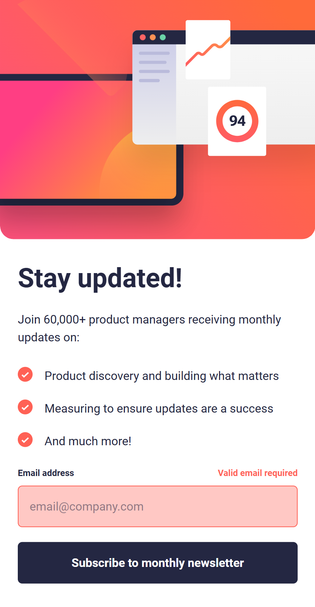

# Newsletter sign-up form

This project is a newsletter sign-up form built with **React** and **Tailwind CSS**.
It is my **second project using React** and the **first time working with Tailwind CSS**.

The application allows the user to enter their email address and submit the form.
After a successful submission, the user is redirected to a Thank You page.

## Live demo
https://playful-melomakarona-2377e5.netlify.app/

# What I practiced

- Using useState for managing form state and error messages
- Navigating between pages with React Router
- Passing data between pages with navigate
- Building responsive layouts with Tailwind CSS

